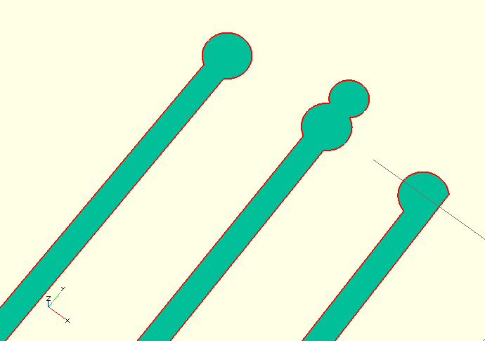
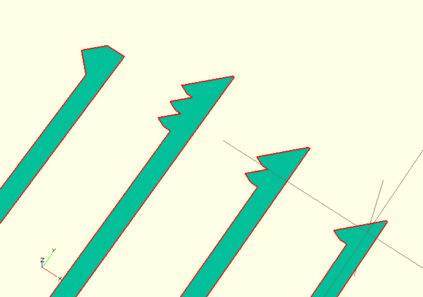
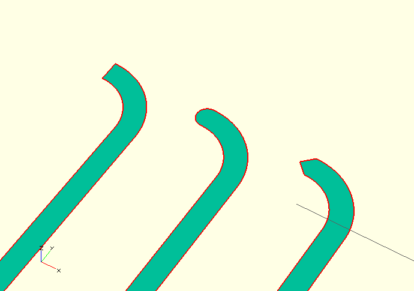

Lockpickr
=========

In near future I will gain access to a full fledged laser-cutter...

So I decided to make myself a pickset!

``Shoop Da Whoop I'm A Firing My Lazor!!``

:warning: Do **not** pick locks you do not own or don't have permission to do so! Anything else is burglary or malicious injury of property! *No exceptions*!

This is still work in progress, I will still have to figure out the correct sizes and values, and find the best working metal. Recommendations are highly welcome!

Previews
--------

Here are some quick-and-dirty screenshots just to give you a quick hint how this looks like..

.. note:: These screenshots do not really represent reality, I will not refresh them every time I update the code.

- Circles

- Triangles

- Bows

